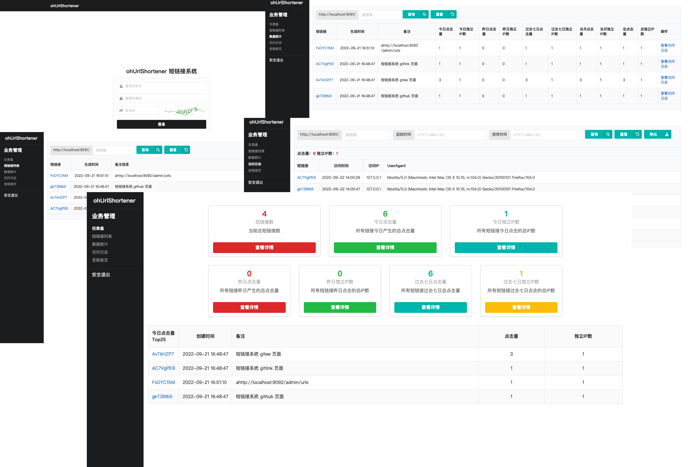

# ohUrlShortener

 适合中小型社区网站使用的企业级短链接服务系统，支持短链接生产、查询及302转向，并自带点击量统计、独立IP数统计、访问日志查询：

1. 支持 Docker One Step Start 部署启动
1. 支持短链接生产、查询、存储、302转向
1. 支持访问日志查询、访问量统计、独立IP数统计
1. 支持 HTTP API 方式新建短链接、禁用/启用短链接、查看短链接统计信息、管理员设置
1. 支持访问日志导出，方便线下分析



<p style="text-align: center">
<a target="_blank" href="https://www.ohurls.cn">https://www.ohurls.cn</a><br/><br/>
<a target="_blank" href="https://github.com/barats/ohUrlShortener/stargazers"></a>
<a target="_blank" href="https://github.com/barats/ohUrlShortener/network/members"></a>
<a target="_blank" href="https://github.com/barats/ohUrlShortener/issues"></a>  
<a target="_blank" href='https://gitee.com/barat/ohurlshortener/stargazers'></a>
<a target="_blank" href='https://gitee.com/barat/ohurlshortener/members'></a>
<a target="_blank" href='https://www.oschina.net/comment/project/64133'></a> 
<a target="_blank" href="https://hub.docker.com/r/baratsemet/ohurlshortener-portal"></a>
<a target="_blank" href="https://hub.docker.com/r/baratsemet/ohurlshortener-admin"></a>
</p>


## 快速使用

Docker 一步启动所有服务，运行 `docker/one_step_start.sh` ，该命令将会：  
1. 拉取 [baratsemet/ohurlshortener-admin](https://hub.docker.com/r/baratsemet/ohurlshortener-admin) 镜像（本地构建可查看 `docker/admin.Dockerfile`）
1. 拉取 [baratsemet/ohurlshortener-portal](https://hub.docker.com/r/baratsemet/ohurlshortener-portal) 镜像（本地构建镜像可查看`docker/portal.Dockerfile`）
1. 通过 `docker/pull_build.yml` 其他描述内容构建 `redis` 和 `postgresql` 镜像及服务，并对其运行状态做判断，等待缓存和数据库服务正常之后，再启动其他必要服务 (本地构建镜像请查阅 `local_build.yml`) 
1. 构建名为 `network_ohurlshortener` 的虚拟网络供上述服务使用
1. 开启本机 `9091`、`9092` 端口分别应对 `ohUrlShortener-Portal` 及 `ohUrlShortener-Admin` 应用


## 参数说明  

```shell
ohurlshortener [-c config_file] [-s admin|portal|<omit to start both>]  
```

## 配置文件
根目录下 `config.ini` 中存放着关于 ohUrlShortener 短链接系统的一些必要配置，请在启动应用之前确保这些配置的正确性

```ini
[app]

# 短链接系统本地启动端口
port = 9091

# 短链接系统管理后台本地启动端口
admin_port = 9092

# 例如：https://t.cn/ 是前缀(不要忘记最后一个/符号)
url_prefix = http://localhost:9091/

# captcha 验证码默认会写入内存，也可以指定存储到 redis
[captcha]
store = memory
# store = redis

# Redis 配置信息 
[redis]
host = redis:6379
database = 0
username =
password =
pool_size = 50

# Redis 集群配置
[redis-cluster]
hosts = localhost:6371,localhost:6372,localhost:6373,localhost:6374,localhost:6375,localhost:6376
username = 
password = 
pool_size = 50

# Postgresql 数据库配置信息
[postgres]
host = localhost
port = 5432
user = postgres
password = xxx
database = oh_url_shortener
max_open_conn = 20
max_idle_conn = 5
```

## Admin 后台默认帐号 
默认帐号: `ohUrlShortener`  
默认密码: `-2aDzm=0(ln_9^1`  

数据库中存储的是加密后的密码，在 [`structure.sql`](structure.sql) 中标有注释，如果需要自定义其他密码，可以修改这里  

加密规则 `storage/users_storage.go` 中

```golang 
func PasswordBase58Hash(password string) (string, error) {
	data, err := utils.Sha256Of(password)
	if err != nil {
		return "", err
	}
	return base58.Encode(data), nil
}
```

亦可参照 `storage/users_storage_test.go` 中的 `TestNewUser()` 方法

## HTTP API 支持

管理端 HTTP API 支持请参阅 [ohUrlShortener HTTP API](API.md)

```golang
api := router.Group("/api", controller.APIAuthHandler())
api.POST("/account", controller.APINewAdmin)
api.PUT("/account/:account/update", controller.APIAdminUpdate)
api.POST("/url", controller.APIGenShortUrl)
api.GET("/url/:url", controller.APIUrlInfo)
api.DELETE("/url/:url", controller.APIDeleteUrl)
api.PUT("/url/:url/change_state", controller.APIUpdateUrl)
```

## 短链接在应用启动时会存入 Redis 中

所有短链接再系统启动时会以 `Key(short_url) -> Value(JSON{original_url,open_type})` 的形式存储在 Redis 中。

### 1. 为什么要这么做？  

当短链接的查询请求进入应用时，为了能够更快、更准确的将用户请求转向到目标链接，与传统的方式从数据库中查询相比，直接从 Redis 中获取目标链接就会显得更有价值。

### 2. 这种处理方式有什么缺点？

理论上来说，如果 Redis 所在的服务器的内存较大的话，存储10w个Key也是可以的。但是，硬件条件不允许的情况下，就需要控制 Redis 中的 Key 数量（主要是怕机器扛不住，Redis 本身的性能不会有问题）。这部分的功能扩展，考虑在将来的某个版本中实现并允许配置管理。

### 3. 万一 

考虑到可扩展性，多封装了一层 `service`，以便需要的时候在业务逻辑层进行自定义扩展，eg：将 key 查询改成数据库查询等。  

## 短链接生产过程相关代码

所在文件 `core/short_url.go` 

```golang
func GenerateShortLink(initialLink string) (string, error) {
	if utils.EmptyString(initialLink) {
		return "", fmt.Errorf("empty string")
	}
	urlHash, err := utils.Sha256Of(initialLink)
	if err != nil {
		return "", err
	}
	str := utils.Base58Encode(urlHash)
	return str[:8], nil
}
```

## 访问日志处理间隔：1分钟

所在文件 `main.go` 

```golang
//清理 Redis 中的访问日志的时间间隔
const AccessLogCleanInterval = 1 * time.Minute

func startTicker() error {
	ticker := time.NewTicker(AccessLogCleanInterval)
	for range ticker.C {
		log.Println("[StoreAccessLog] Start.")
		if err := service.StoreAccessLogs(); err != nil {
			log.Printf("Error while trying to store access_log %s", err)
		}
		log.Println("[StoreAccessLog] Finish.")
	}
	return nil
}
```

## 当日 Top25 访问 URL 榜单处理间隔：5分钟
所在文件 `main.go`

```golang
// Top25 榜单计算间隔
Top25CalcInterval = 5 * time.Minute

func startTicker2() error {
	top25Ticker := time.NewTicker(Top25CalcInterval)
	for range top25Ticker.C {
		log.Println("[Top25Urls Ticker] Start.")
		if err := storage.CallProcedureStatsTop25(); err != nil {
			log.Printf("Error while trying to calculate Top25Urls %s", err)
		}
		log.Println("[Top25Urls Ticker] Finish.")
	}
	return nil
}
```

## 仪表盘中几个相关统计处理间隔：5分钟
所在文件 `main.go`

```golang
// 仪表盘页面中其他几个统计数据计算间隔
StatsSumCalcInterval = 5 * time.Minute

func startTicker4() error {
	statsSumTicker := time.NewTicker(StatsSumCalcInterval)
	for range statsSumTicker.C {
		log.Println("[StatsSum Ticker] Start.")
		if err := storage.CallProcedureStatsSum(); err != nil {
			log.Printf("Error while trying to calculate StatsSum %s", err)
		}
		log.Println("[StatsSum Ticker] Finish.")
	}
	return nil
}
```

## 全部访问日志统计处理间隔：30分钟
所在文件 `main.go`

```golang
//全部访问日志分析统计的间隔
StatsIpSumCalcInterval = 30 * time.Minute

func startTicker3() error {
	statsIpSumTicker := time.NewTicker(StatsIpSumCalcInterval)
	for range statsIpSumTicker.C {
		log.Println("[StatsIpSum Ticker] Start.")
		if err := storage.CallProcedureStatsIPSum(); err != nil {
			log.Printf("Error while trying to calculate StatsIpSum %s", err)
		}
		log.Println("[StatsIpSum Ticker] Finish.")
	}
	return nil
}
```

## License 

ohUrlShortener 以《木兰宽松许可证》 第2版 为开源协议发布  

```
Copyright (c) [2023] [巴拉迪维]
[ohUrlShortener] is licensed under Mulan PSL v2.
You can use this software according to the terms and conditions of the Mulan PSL v2.
You may obtain a copy of Mulan PSL v2 at:
         http://license.coscl.org.cn/MulanPSL2
THIS SOFTWARE IS PROVIDED ON AN "AS IS" BASIS, WITHOUT WARRANTIES OF ANY KIND,
EITHER EXPRESS OR IMPLIED, INCLUDING BUT NOT LIMITED TO NON-INFRINGEMENT,
MERCHANTABILITY OR FIT FOR A PARTICULAR PURPOSE.
See the Mulan PSL v2 for more details.
```

## Contributor License Agreement

在 **第一次提交 Pull Request 时** ，请您在 Pull Request 内容中明确写明「本人自愿接受并签署 [《ohUrlShortener Contributor License Agreement》](CLA.md)」，并在 Pull Request 信息中附带该协议链接信息。

## Give Thanks To

由衷感谢以下开源软件、框架等（包括但不限于）

1. [gin-gonic/gin](https://github.com/gin-gonic/gin) 
2. [FomanticUI](https://fomantic-ui.com/)
3. [dchest/captcha](https://github.com/dchest/captcha) 
4. [Masterminds/sprig](https://github.com/Masterminds/sprig)
5. [go-redis/redis](https://github.com/go-redis/redis/) 
6. [jmoiron/sqlx](https://github.com/jmoiron/sqlx)
7. [go-ini/ini](https://github.com/go-ini/ini)

## ohUrlShortener 
1. [ohUrlShortener 短链接系统 v2.0 发布，指定「打开方式」功能支持](https://www.oschina.net/news/241622/ohurlshortener-2-0-released)
1. [ohUrlShortener 短链接系统 v1.9 发布，Redis Cluster 集群支持](https://www.oschina.net/news/230519/ohurlshortener-1-9-released)
1. [ohUrlShortener 短链接系统 v1.8 发布，API 问题处理](https://www.oschina.net/news/228559/ohurlshortener-1-8-released)
1. [ohUrlShortener 短链接系统 v1.7 发布，安全更新](https://www.oschina.net/news/211116/ohurlshortener-1-7-released)
1. [ohUrlShortener 短链接系统 v1.6 发布，统计功能增强](https://www.oschina.net/news/207439/ohurlshortener-1-6-released) 
1. [ohUrlShortener 短链接系统 v1.5 发布，管理功能增强](https://www.oschina.net/news/200621/ohurlshortener-1-5-released)
1. [ohUrlShortener 短链接系统 v1.4 正式发布](https://www.oschina.net/news/194904/ohurlshortener-1-4-released)
2. [ohUrlShortener 短链接系统 v1.3 发布，支持导出访问日志](https://www.oschina.net/news/193422/ohurlshortener-1-3-released)
3. [ohUrlShortener 短链接系统 v1.2 正式发布](https://www.oschina.net/news/190546/ohurlshortener-1-2-released)
1. [ohUrlShortener 短链接服务系统 1.0 发布](https://www.oschina.net/news/190168/ohurlshortener-1-0-released)
4. 软件信息收录 [https://www.oschina.net/p/ohurlshortener](https://www.oschina.net/p/ohurlshortener)
5. Gitee [https://gitee.com/barat/ohurlshortener](https://gitee.com/barat/ohurlshortener)
6. Github [https://github.com/barats/ohUrlShortener](https://github.com/barats/ohUrlShortener)
7. Gitlink [https://www.gitlink.org.cn/baladiwei/ohurlshortener](https://www.gitlink.org.cn/baladiwei/ohurlshortener)

## Stargazers over time
[](https://starchart.cc/barats/ohUrlShortener)

